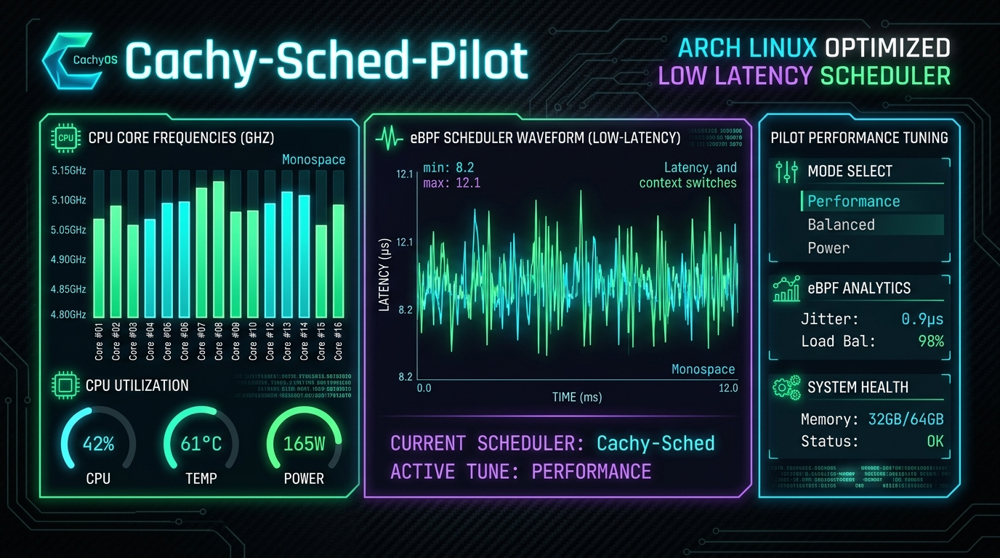

# ⚡ Cachy-Sched-Pilot

<div align="center">



**Autonomous sched-ext (SCX) Benchmark, Tuner & Workload Governor for CachyOS / Arch Linux**

[](https://aur.archlinux.org/)
[](https://cachyos.org)
[](https://www.python.org/)
[](https://textual.textualize.io/)
[](LICENSE)

*Read this document in: [English](#english-overview) | [Deutsch](README_DE.md)*

</div>

---

<a name="english-overview"></a>
## 🚀 Overview (English)

**Cachy-Sched-Pilot** is a production-grade CPU scheduler telemetry, tuning, and benchmarking suite specifically architected for **CachyOS** and **Arch Linux** kernels featuring **sched-ext** (`SCX`) and optimized kernel schedulers (**BORE**, **EEVDF**, **cacULE**).

It enables users and automation scripts to monitor CPU scheduler internals, switch schedulers on-the-fly with zero latency penalties, apply workload profiles (Gaming, Compilation, Low-Latency Audio, Power Saving), and prevent lockups with an automated **safety crash fallback engine**.

---

### ✨ Key Features

1. **Unprivileged Interactive TUI (`textual`)**:
   - Modern Terminal UI running strictly unprivileged as standard user.
   - Live per-core CPU utilization bars, clock speeds, governor states, and EPP hints.
   - Dynamic button capability detection (gracefully disables missing schedulers).
   - Real-time language toggle (`L` key) between English and German.

2. **Privilege Separation via Polkit**:
   - Scheduler switching, scaling governors, and sysfs/sysctl writes route securely through `cachy-sched-helper`.
   - Authorized via `org.cachyos.schedpilot.policy` (no full root terminal needed).

3. **Safety Fallback & Crash Protection**:
   - Real-time watchdog monitors `/sys/kernel/sched_ext/state`.
   - If an experimental user-space eBPF scheduler crashes or exits unexpectedly, the tool immediately reverts to the default kernel scheduler (BORE / EEVDF) without freezing your desktop.

4. **Micro-Benchmark Suite**:
   - High-precision wake-up latency test (nanosecond resolution) to detect frame drops and audio xruns.
   - Context switch throughput evaluation and automated performance rating (S, A+, A, B, C).

5. **Headless Automation & JSON Output**:
   - Fully scriptable via `--status --json`, `--set-profile <profile>`, and `--set-sched <name>`.
   - Ready for integration with **Hyprland**, **KDE Plasma shortcuts**, **Waybar**, and **udev** rules.

---

## 📊 Supported Schedulers

| Scheduler | Type | Best For | Typical Workloads |
| :--- | :--- | :--- | :--- |
| **`scx_lavd`** | sched-ext (eBPF) | Gaming, Audio, Emulation | CS2, Cyberpunk, RPCS3, REAPER, DAWs |
| **`scx_rusty`** | sched-ext (Rust/eBPF) | Multi-Thread Throughput | GCC, Clang, Cargo, Blender, Video Encoding |
| **`scx_bpfland`** | sched-ext (vruntime) | Balanced Multitasking | Daily browsing, media playback, coding |
| **`scx_flash`** | sched-ext (eBPF) | Fast responsive desktop | Low core count CPUs, web engines |
| **`BORE`** | Native CachyOS Kernel | General responsiveness | Low-latency desktop without eBPF overhead |
| **`EEVDF`** | Native Linux (6.6+) | General purpose | Standard Linux upstream scheduler |

---

## 📦 Installation

### Via Arch User Repository (AUR / CachyOS)
```bash
# Using yay
yay -S cachy-sched-pilot

# Using paru
paru -S cachy-sched-pilot
```

### Manual / Development Installation
```bash
git clone https://github.com/Graba92/cachy-sched-pilot.git
cd cachy-sched-pilot

# Install runtime dependencies (Arch/CachyOS)
sudo pacman -S python python-psutil python-rich python-textual polkit scx-scheds

# Install polkit policy (optional for unprivileged switching)
sudo cp packaging/org.cachyos.schedpilot.policy /usr/share/polkit-1/actions/

# Run interactive dashboard
python3 app.py tui
```

---

## ⌨️ TUI Keybindings

| Key | Action |
| :---: | :--- |
| <kbd>q</kbd> | Quit application |
| <kbd>r</kbd> | Refresh telemetry immediately |
| <kbd>l</kbd> | Toggle language between **English** and **Deutsch** |
| <kbd>b</kbd> | Run micro-benchmark on active scheduler |
| <kbd>d</kbd> | Run system doctor diagnostics |

---

## 💻 CLI & Headless Usage

```bash
# 1. Inspect live system status (Human-readable)
cachy-sched-pilot --status

# 2. Export machine-readable JSON for Hyprland / Waybar / scripts
cachy-sched-pilot --status --json

# 3. Switch to a pre-tuned profile
cachy-sched-pilot --set-profile gaming
cachy-sched-pilot --set-profile compile
cachy-sched-pilot --set-profile powersave

# 4. Switch directly to a specific scheduler
cachy-sched-pilot --set-sched scx_lavd
cachy-sched-pilot --set-sched default

# 5. Run system diagnostics
cachy-sched-pilot --doctor

# 6. Run autonomous background governor
cachy-sched-pilot governor --interval 2.5
```

---

## ⚙️ Configuration (`config.toml`)

Cachy-Sched-Pilot strictly follows XDG specifications. Configuration is searched in:
1. `$XDG_CONFIG_HOME/sched-pilot/config.toml` (or `~/.config/sched-pilot/config.toml`)
2. `/etc/sched-pilot/config.toml`

See [`config.example.toml`](config.example.toml) for complete options and custom scheduler flags.

---

## 🛡️ Security Architecture & Polkit

Cachy-Sched-Pilot separates privileged execution:
- **TUI & CLI**: Always execute unprivileged with standard user rights.
- **`cachy-sched-helper`**: A dedicated helper with strict allowlists (`/usr/lib/cachy-sched-pilot/cachy-sched-helper`).
- **PolicyKit**: Managed through `org.cachyos.schedpilot.policy`, allowing authorized desktop users to switch schedulers without typing sudo passwords repeatedly.

---

## 📄 License

Distributed under the **MIT License**. See [LICENSE](LICENSE) for more details.
Developed by Matze Graba & the CachyOS Open Source Community.
