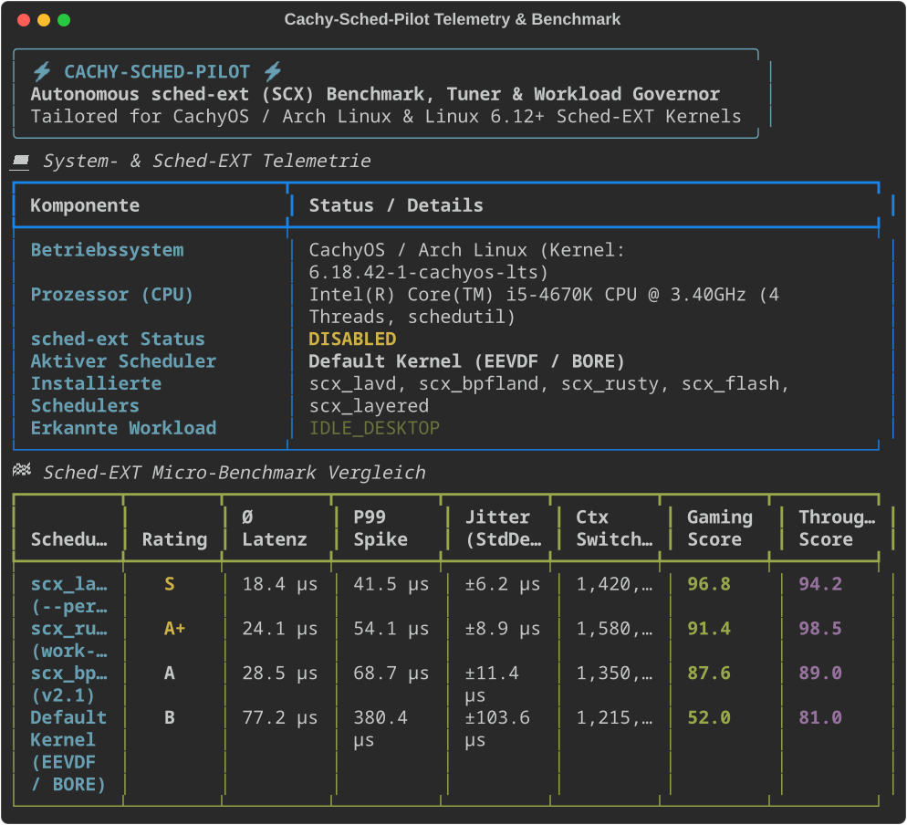
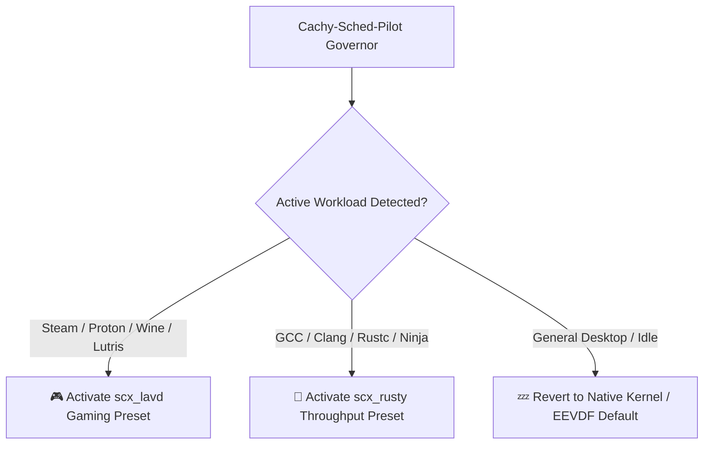

[🇩🇪 Zur deutschen Dokumentation wechseln](README_DE.md) | [🇬🇧 Switch to English Documentation](README.md)

# ⚡ Cachy-Sched-Pilot

<p align="center">
  
</p>

<p align="center">
  <a href="https://github.com/Graba92/cachy-sched-pilot"></a>
  <a href="https://cachyos.org"></a>
  
  <a href="https://python.org"></a>
  <a href="https://textual.textualize.io"></a>
  <a href="LICENSE"></a>
</p>

> **Cachy-Sched-Pilot** is an autonomous micro-benchmark suite, zero-reboot hot-swapper, and workload governor for **sched-ext (SCX)** on **CachyOS & Arch Linux**.
>
> Built for Linux gamers, developers, and power users who want to put an end to endless community guesswork: *“Which CPU scheduler gives me the lowest latency spikes, zero audio drops, and the smoothest 1% low FPS on my Ryzen/Intel CPU?”*

---

## 📑 Table of Contents
1. [Why Cachy-Sched-Pilot?](#-why-cachy-sched-pilot)
2. [Key Features](#-key-features)
3. [Benchmark Methodology & Metrics](#-benchmark-methodology--metrics)
4. [Architecture & Project Structure](#-architecture--project-structure)
5. [Installation & Quickstart](#-installation--quickstart)
6. [CLI & TUI Usage Guide](#-cli--tui-usage-guide)
7. [Autopilot Workload Governor](#-autopilot-workload-governor)
8. [License](#-license)

---

## 🎯 Why Cachy-Sched-Pilot?

In the CachyOS, Arch Linux, and Linux gaming communities, there is a recurring debate:
*Is `scx_lavd`, `scx_rusty`, `scx_bpfland`, or the default BORE kernel best for gaming and day-to-day use?*

The unanimous response across Reddit and forums is always: **“Test it yourself on your own hardware!”** Yet until now, there was no straightforward, automated tool to run reliable, reproducible nanosecond-level latency and jitter benchmarks across these schedulers.

**Cachy-Sched-Pilot solves this directly:**
- Measures actual wake-up latency and P99 latency spikes under realistic load.
- Calculates an objective **Gaming Latency Score** (heavy focus on jitter reduction) and **Throughput Score** (focus on multi-threaded context switching).
- Provides instant zero-reboot hot-swapping between schedulers.
- Runs an optional background governor that detects when games (Steam, Proton, Wine) or heavy build tasks (GCC, Clang, Rustc, Ninja) launch, automatically switching to the optimal scheduler.

---

## ✨ Key Features

- 🔬 **High-Precision Micro-Benchmark Suite**:
  - Quantifies mean latency (Ø µs), minimum, maximum, P95 and P99 spike latencies, and jitter standard deviation.
  - Measures real OS thread yield and context switch throughput per second.
- 🔄 **Zero-Reboot Hot-Swapping**:
  - Hot-swap on the fly between `scx_lavd`, `scx_rusty`, `scx_bpfland`, `scx_flash`, and native kernel default (EEVDF/BORE).
  - Graceful process termination and safe fallback without kernel panics or frozen desktop sessions.
- 🤖 **Autonomous Workload Governor (Autopilot)**:
  - Automatically recognizes when Steam, Proton, Heroic Games, or Lutris starts, instantly activating the gaming profile (`scx_lavd --performance`).
  - Detects resource-intensive compilation jobs (`gcc`, `cargo`, `ninja`, `make`) and swaps to high-throughput mode (`scx_rusty`).
  - Gracefully reverts to default power-saving states when the system returns to desktop idle.
- 🖥️ **Dual Interface**:
  - **Interactive Textual TUI**: Sleek terminal dashboard with live gauges, tab navigation, and comparison tables.
  - **Headless CLI Core**: Scriptable for automated CI/CD runs, hardware testing, or shell shortcuts.

---

## 📊 Benchmark Methodology & Metrics

| Metric | Unit | System & Gaming Relevance |
| :--- | :--- | :--- |
| **Mean Latency (Ø)** | Microseconds (µs) | Average delay before a sleeping thread receives CPU execution time. |
| **P99 Spike Latency** | Microseconds (µs) | The worst 1% of all wake-up events. **Directly responsible for 1% low frame drops and stuttering in games!** |
| **Jitter (StdDev)** | Microseconds (µs) | Consistency of task scheduling. Lower jitter equals superior frame-pacing. |
| **Context Switches/s** | Switches / second | Maximum throughput under severe thread contention (browser, Discord, OBS, background daemons). |
| **Gaming Score** | 0 – 100 points | Weighted heavily towards low latency and zero jitter spikes. |
| **Throughput Score** | 0 – 100 points | Weighted towards parallel computation and high context-switching frequency. |

---

## 🏛️ Architecture & Project Structure

```text
cachy-sched-pilot/
├── app.py                      # Master CLI & TUI entry point
├── run.sh                      # Universal runner (auto-detects virtualenv)
├── setup.sh                    # Automated setup script (pacman / yay)
├── requirements.txt            # Python dependencies (rich, textual, psutil)
├── LICENSE                     # MIT License
├── README.md                   # English documentation (this file)
├── README_DE.md                # German documentation
├── .gitignore                  # Git ignore rules
├── preview_cli.png             # High-resolution terminal showcase image
│
├── core/
│   ├── detector.py             # CPU topology, CachyOS kernel & SCX binary detector
│   ├── benchmark.py            # Nanosecond latency, jitter & context-switch engine
│   ├── manager.py              # Hot-swapping controller & process lifecycle manager
│   ├── governor.py             # Autonomous background process watcher
│   └── profiles.py             # Pre-configured tuning profiles
│
└── ui/
    ├── console.py              # Rich CLI terminal formatting & tables
    └── tui.py                  # Fullscreen interactive Textual dashboard
```

---

## 🚀 Installation & Quickstart

### 1. Automated Installation (CachyOS / Arch Linux)

```bash
git clone https://github.com/Graba92/cachy-sched-pilot.git
cd cachy-sched-pilot
chmod +x setup.sh
./setup.sh
```

The setup script automatically checks for `scx-scheds` and `scx-tools`, installs Python requirements (`rich`, `textual`, `psutil`), and symlinks the binary into `~/.local/bin/cachy-sched-pilot`.

### 2. Manual Installation

```bash
sudo pacman -S --needed scx-scheds scx-tools python python-rich python-psutil
pip install --user textual
./run.sh status
```

---

## 🎮 CLI & TUI Usage Guide

### Inspect System Status & Telemetry
```bash
cachy-sched-pilot status
```

### Run Full System & Kernel Health Check (Doctor)
```bash
cachy-sched-pilot doctor
```
Verifies sysfs sched-ext presence, CachyOS BORE patches, eBPF JIT compiler status, `scxctl` D-Bus tool, installed schedulers, and Polkit elevation permissions.

### Run Micro-Benchmark for Active Scheduler
```bash
cachy-sched-pilot bench --iterations 1500
```

### Hot-Swap Schedulers Manually
```bash
# Switch to gaming-tuned scheduler (supports scxctl & direct daemon):
cachy-sched-pilot switch scx_lavd

# Switch to compilation-tuned scheduler:
cachy-sched-pilot switch scx_rusty

# Switch to balanced desktop scheduler:
cachy-sched-pilot switch scx_bpfland

# Revert to standard kernel default:
cachy-sched-pilot stop
```

### Inspect Pre-Configured Tuning Profiles
```bash
cachy-sched-pilot profiles
```
Includes profiles for **Gaming & E-Sports**, **Pro Audio & DAW (Zero Xrun)**, **Emulation & High-Cache (RPCS3/Ryujinx)**, **Heavy Compilation**, and **Balanced Desktop**.

### Run Test Suite
```bash
python3 -m unittest discover -s tests -p "test_*.py"
```

### Launch Autonomous Workload Governor Daemon
```bash
cachy-sched-pilot governor --interval 3.0
```

### Launch Interactive Textual TUI
```bash
cachy-sched-pilot tui
```

---

## 🤖 Autopilot Workload Governor

The autopilot daemon monitors process lifecycle changes and dynamically hot-swaps schedulers without user intervention:



---

## 📜 License

Distributed under the [MIT License](LICENSE) — Created by [Graba92](https://github.com/Graba92).
