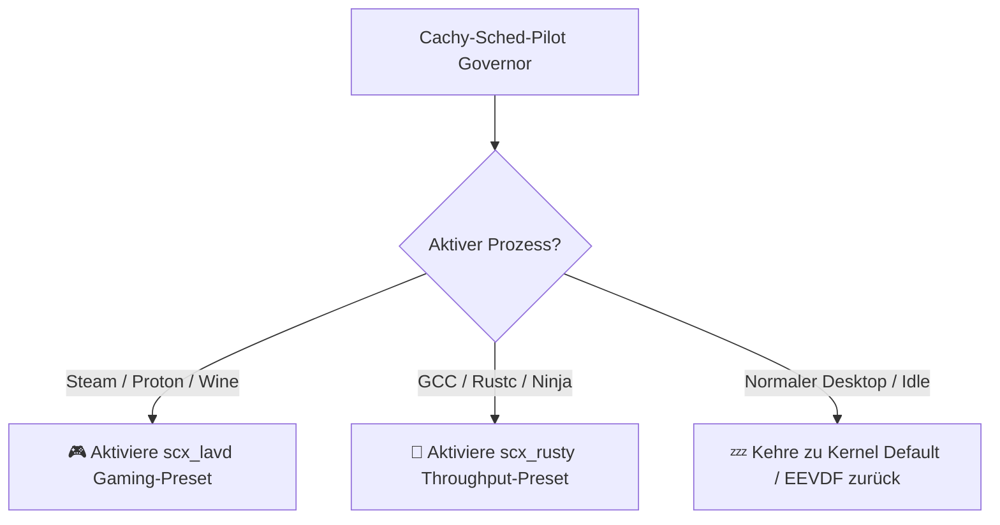

[🇩🇪 Zur deutschen Dokumentation wechseln](README_DE.md) | [🇬🇧 Switch to English Documentation](README.md)

# ⚡ Cachy-Sched-Pilot

<p align="center">
  
</p>

<p align="center">
  <a href="https://github.com/Graba92/cachy-sched-pilot"></a>
  <a href="https://cachyos.org"></a>
  
  <a href="https://python.org"></a>
  <a href="https://textual.textualize.io"></a>
  <a href="LICENSE"></a>
</p>

> **Cachy-Sched-Pilot** ist ein autonomer Micro-Benchmark, Hot-Swapper und Workload-Governor für **sched-ext (SCX)** unter **CachyOS & Arch Linux**.
>
> Entwickelt für Linux-Gamer, Entwickler und Power-User, die Schluss machen wollen mit dem Rätselraten: *„Welcher CPU-Scheduler liefert auf meinem Ryzen/Intel die stabilsten 1% Low FPS und die geringsten Latenz-Spikes?“*

---

## 📑 Inhaltsverzeichnis
1. [Warum Cachy-Sched-Pilot?](#-warum-cachy-sched-pilot)
2. [Kernfunktionen](#-kernfunktionen)
3. [Benchmark-Methodik & Metriken](#-benchmark-methodik--metriken)
4. [Architektur & Projektstruktur](#-architektur--projektstruktur)
5. [Installation & Schnellstart](#-installation--schnellstart)
6. [CLI & TUI Bedienungsanleitung](#-cli--tui-bedienungsanleitung)
7. [Autopilot-Governor (Gaming vs. Compile)](#-autopilot-governor)
8. [Lizenz](#-lizenz)

---

## 🎯 Warum Cachy-Sched-Pilot?

In der CachyOS- und Linux-Gaming-Community tobt eine ständige Debatte:
*Ist `scx_lavd`, `scx_rusty`, `scx_bpfland` oder der Standard-BORE-Kernel besser?*

Die einhellige Antwort auf Reddit und in Foren lautet stets: **„Teste es selbst auf deiner eigenen Hardware!“** Doch bisher gab es kein einfaches Werkzeug, um dies automatisiert, reproduzierbar und mit echten Nanosekunden-Latenzmessungen durchzuführen.

**Cachy-Sched-Pilot schließt diese Lücke:**
- Misst die reale Aufwach-Latenz und P99-Spikes unter Last.
- Berechnet einen aussagekräftigen **Gaming-Score** (Fokus auf minimalen Jitter) und **Throughput-Score** (Fokus auf Multithread-Kontextwechsel).
- Ermöglicht 1-Klick Hot-Swapping ohne Reboot.
- Überwacht im Hintergrund automatisch aktive Spiele (Steam, Proton, Wine) oder Compiler-Läufe und schaltet autonom auf den besten Scheduler um.

---

## ✨ Kernfunktionen

- 🔬 **High-Precision Micro-Benchmark Suite**:
  - Ermittelt mittlere Latenz (Ø µs), Minimum, Maximum, P95- und P99-Latenzen sowie Standardabweichung (Jitter).
  - Testet reale Thread-Yield- und Kontextwechselraten pro Sekunde.
- 🔄 **Zero-Reboot Hot-Swapping**:
  - Schaltet im laufenden Betrieb zwischen `scx_lavd`, `scx_rusty`, `scx_bpfland`, `scx_flash` und dem Kernel-Standard (EEVDF/BORE) um.
  - Saubere Beendigung und Fallback ohne Kernel-Panics oder Hänger.
- 🤖 **Autonomer Workload-Governor (Auto-Pilot)**:
  - Erkennt automatisch den Start von Steam, Proton, Heroic Games oder Lutris und aktiviert das Gaming-Profil (`scx_lavd --performance`).
  - Erkennt ressourcenintensive Build-Jobs (`gcc`, `cargo`, `ninja`) und aktiviert das Compile-Profil (`scx_rusty`).
  - Kehrt bei Leerlauf automatisch zum stromsparenden Standard zurück.
- 🖥️ **Duales Interface**:
  - **Interaktives Textual TUI**: Modernes Dashboard mit Live-Gauges, Reiter-Navigation und Tabellen.
  - **Headless CLI Core**: Perfekt für Skripte, Benchmarks und Terminal-Automatisierung.

---

## 📊 Benchmark-Methodik & Metriken

| Metrik | Einheit | Bedeutung für das System |
| :--- | :--- | :--- |
| **Ø Latenz (Mean)** | Mikrosekunden (µs) | Durchschnittliche Verzögerung bis ein schlafender Thread CPU-Rechenzeit erhält. |
| **P99 Spike Latenz** | Mikrosekunden (µs) | Die schlechtesten 1 % aller Aufwach-Ereignisse. **Direkt verantwortlich für 1% Low Ruckler in Spielen!** |
| **Jitter (StdDev)** | Mikrosekunden (µs) | Gleichmäßigkeit des Schedulings. Je niedriger, desto flüssiger das Frame-Pacing. |
| **Kontextwechsel/s** | Switches / Sekunde | Maximaler Durchsatz bei starker Thread-Konkurrenz (Browser, Streaming, Server). |
| **Gaming Score** | 0 – 100 Punkte | Bewertet vorrangig Latenzarmut und Jitterfreiheit. |
| **Throughput Score**| 0 – 100 Punkte | Bewertet Parallelisierung und Kontextwechselkapazität. |

---

## 🏛️ Architektur & Projektstruktur

```text
cachy-sched-pilot/
├── app.py                      # Master CLI & TUI Einstiegspunkt
├── run.sh                      # Universeller Starter (mit Auto-Venv-Erkennung)
├── setup.sh                    # Automatischer Abhängigkeits-Installer (pacman / yay)
├── requirements.txt            # Python-Abhängigkeiten (rich, textual, psutil)
├── LICENSE                     # MIT Lizenz
├── README.md                   # Englische Dokumentation
├── README_DE.md                # Deutsche Dokumentation (diese Datei)
├── .gitignore                  # Git-Ignore-Regeln
├── preview_cli.png             # Hochauflösende Terminal-Vorschau
│
├── core/
│   ├── detector.py             # CPU-Topologie, Kernel-Version & SCX-Binary-Erkennung
│   ├── benchmark.py            # Nanosekunden-Latenz-, Jitter- & Durchsatz-Engine
│   ├── manager.py              # Hot-Swapping Controller & Prozess-Bereinigung
│   ├── governor.py             # Autonomer Hintergrund-Prozess-Governor
│   └── profiles.py             # Vorkonfigurierte Tuning-Profile
│
└── ui/
    ├── console.py              # Rich CLI Terminal-Formatierung & Tabellen
    └── tui.py                  # Interaktives Textual Terminal Dashboard
```

---

## 🚀 Installation & Schnellstart

### 1. Automatische Installation (CachyOS / Arch Linux)

```bash
git clone https://github.com/Graba92/cachy-sched-pilot.git
cd cachy-sched-pilot
chmod +x setup.sh
./setup.sh
```

Das Skript installiert automatisch `scx-scheds`, `scx-tools`, Python-Pakete (`rich`, `textual`, `psutil`) und verlinkt das Binary nach `~/.local/bin/cachy-sched-pilot`.

### 2. Manuelle Installation

```bash
sudo pacman -S --needed scx-scheds scx-tools python python-rich python-psutil
pip install --user textual
./run.sh status
```

---

## 🎮 CLI & TUI Bedienungsanleitung

### Status & Telemetrie prüfen
```bash
cachy-sched-pilot status
```

### Vollständige System- & Kernel-Diagnose (Doctor)
```bash
cachy-sched-pilot doctor
```
Überprüft sysfs sched-ext Unterstützung, CachyOS BORE/SCX Kernel-Patches, eBPF JIT Compiler Status, `scxctl` D-Bus Anbindung, installierte Schedulers und Polkit-Rechte.

### Micro-Benchmark des aktiven Schedulers ausführen
```bash
cachy-sched-pilot bench --iterations 1500
```

### Scheduler manuell umschalten (Hot-Swap)
```bash
# Auf Gaming-Scheduler umschalten (unterstützt scxctl & direkte Prozesse):
cachy-sched-pilot switch scx_lavd

# Auf Compile-Scheduler umschalten:
cachy-sched-pilot switch scx_rusty

# Auf Balanced-Desktop-Scheduler umschalten:
cachy-sched-pilot switch scx_bpfland

# Auf Standard-Kernel zurückkehren:
cachy-sched-pilot stop
```

### Verfügbare Tuning-Profile anzeigen
```bash
cachy-sched-pilot profiles
```
Enthält vorkonfigurierte Profile für **Gaming & E-Sports**, **Pro Audio & DAW (Zero Xrun)**, **Emulation & High-Cache (RPCS3/Ryujinx)**, **Heavy Compilation** und **Balanced Desktop**.

### Test-Suite ausführen
```bash
python3 -m unittest discover -s tests -p "test_*.py"
```

### Autonomen Hintergrund-Governor starten
```bash
cachy-sched-pilot governor --interval 3.0
```

### Interaktives Textual TUI starten
```bash
cachy-sched-pilot tui
```

---

## 🤖 Autopilot-Governor

Der Governor kann als Hintergrunddienst laufen und passt den Scheduler vollautomatisch an das an, was du gerade tust:



---

## 📜 Lizenz

Veröffentlicht unter der [MIT-Lizenz](LICENSE) — Entwickelt von [Graba92](https://github.com/Graba92).
